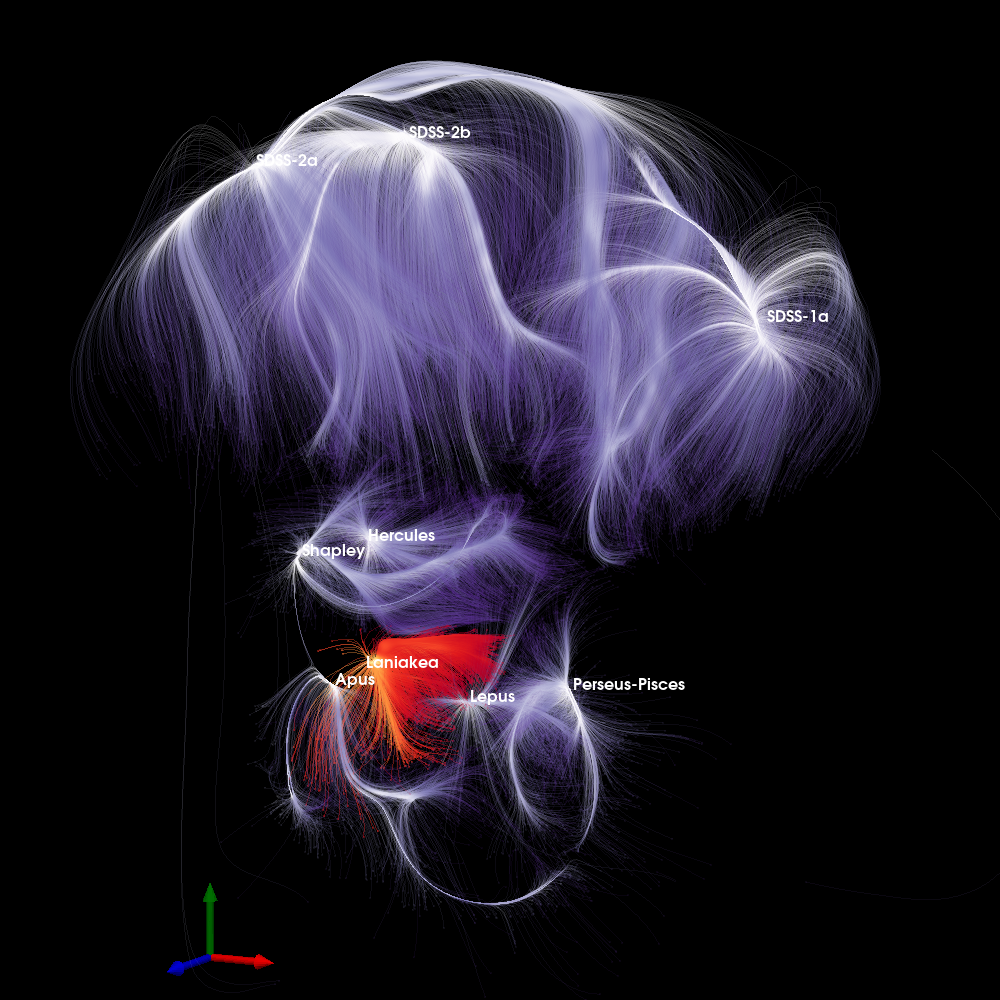

# Dynamic Cosmography of the Local Universe

This repository contains a **Jupyter notebook** demonstrating 3D and 2D visualizations of large-scale cosmic structures in the local Universe, inspired by:

**Dupuy et al., 2023 – _“Dynamic cosmography of the local Universe: Laniakea and five more watershed superclusters”_** ([arXiv:2305.02339](https://arxiv.org/abs/2305.02339))



---

## Overview

The notebook showcases:

- **3D visualization of basins of attraction** (superclusters) using PyVista.
- **Streamlines** integrated from the velocity field inside each basin, illustrating cosmic flows toward attractors.
- **Density fields** represented as isosurfaces to highlight overdense regions.
- **2D mid-plane slices** showing the density of streamlines for a clear, planar view of flow concentrations.
- **Centers of basins** labeled as spheres for reference (e.g., Laniakea, Shapley, Coma).

> **Note:** The original datasets are proprietary and not included.

---

## Skills Highlighted

This project demonstrates:

- Handling **large 3D scientific datasets** (density, velocity, basins, streamlines)
- **3D and 2D data visualization** with PyVista and Matplotlib
- Mapping galaxies to basins and visualizing **cosmic flow patterns**
- Reproducing **publication-quality scientific plots**
- Working with **VTK and FITS file formats** in Python
- Applying **scientific programming best practices** for research visualization

---

## Notebook Structure

1. **Data Overview**
   - Density and velocity fields on a (128³) grid
   - Basins of attraction and repulsion labeled per voxel
   - Cosmicflows-4 galaxy catalog

2. **3D Visualization: Basins and Streamlines**
   - Streamlines integrated from velocity fields inside each basin
   - Laniakea highlighted as the home supercluster
   - Galaxy positions probed against basin labels

3. **3D Visualization: Density Isosurfaces and Streamlines**
   - Density isosurfaces at multiple levels
   - Streamlines illustrating cosmic flows toward attractors
   - Spheres marking basin centers

4. **2D Mid-Plane Slice of Streamline Density**
   - Logarithmic streamline density on the z = N/2 plane
   - Annotations of major superclusters

---

## Running the Notebook

1. Clone the repository:

```bash
git clone https://github.com/aadupuy/dynamic_cosmography.git
cd dynamic-cosmography
```

2. Install required packages

```bash
pip install numpy pandas matplotlib pyvista astropy
```

3. Launch the notebook

```bash
jupyter notebook Dynamic_Cosmography.ipynb
```

> **Note:** You will need your own data.